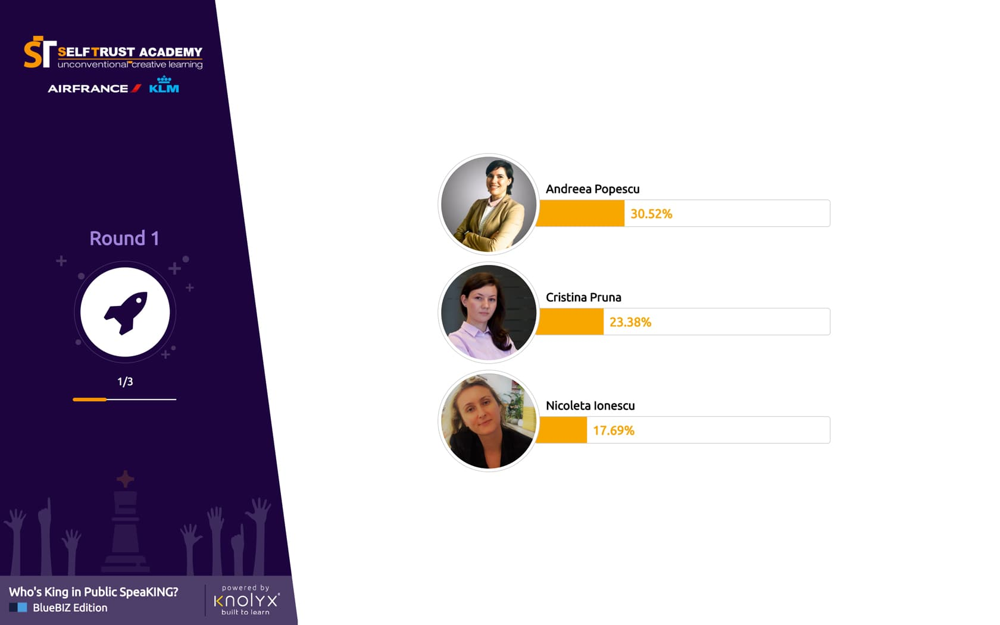

CSS Workshop 1
==============

The first in a series of workshops for learning CSS.

In this workshop we will create a layout for displaying result in a voting platform. At the end of the last exercise we will create the following design:

[](exercise3/docs/screenshot.jpg)

## Prerequisites

A basic CSS course is required to go through this workshop.

As technologies, we will use [Flexbox](https://css-tricks.com/snippets/css/a-guide-to-flexbox/) and [BEM Framework](http://getbem.com/naming/)

## Technical requirements & technology stack

The project requires NodeJS + npm, and port 8000 free to serve the HTML and CSS files.

Every exercise folder uses an express server with webpack dev server that serves the required files and compiles the .scss files on-the-fly.

## Get the repository

This is the simple way to get the project. It will download all files.

```sh
git clone https://github.com/cristiansarov/CSSWorkshop1.git
```

## Run an exercise

To start working on an exercise:

1. Go to the folder

```sh
cd exercise1
```

2. Install dependencies

```sh
npm install
```

3. Start the development server

```sh
npm run dev
```

### This will open a server on port 8000:

[http://localhost:8000](http://localhost:8000)

To stop the dev server and go to the next exercise just press `CTRL+C` and follow the instruction above for the next exercise.

## Exercise Instructions

* [Exercise 1 instructions](exercise1/docs/Instructions.md)
* [Exercise 2 instructions](exercise2/docs/Instructions.md)
* [Exercise 3 instructions](exercise3/docs/Instructions.md)